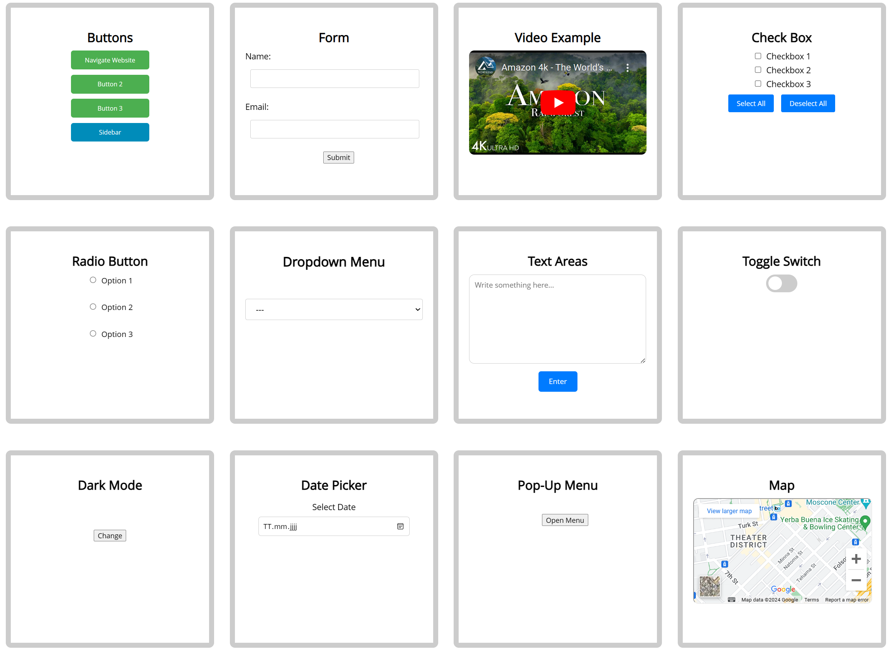

# CSS-JS-Library

This repository contains a collection of CSS and JavaScript files for building web applications. Below is the structure of the repository:

- **css**: This directory contains CSS files used for styling web pages.
- **img**: This directory contains images used within the web application.
- **pages**: This directory contains HTML files for different pages of the web application.
- **uml**: This directory contain UML diagrams or related documentation for the project.
- **index.html**: The main HTML file representing the entry point of the web application.
- **main.js**: JavaScript file(s) containing the main logic and functionality for the web application.

---

    

---

Feel free to explore and utilize the CSS and JavaScript resources provided in this repository to enhance your web projects.
